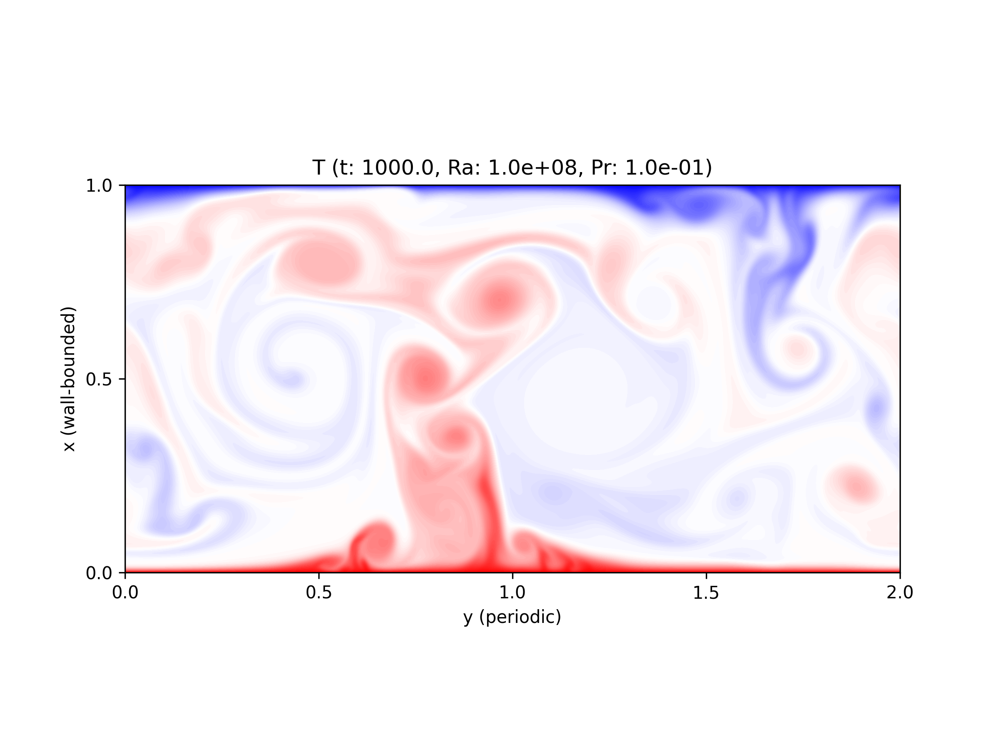
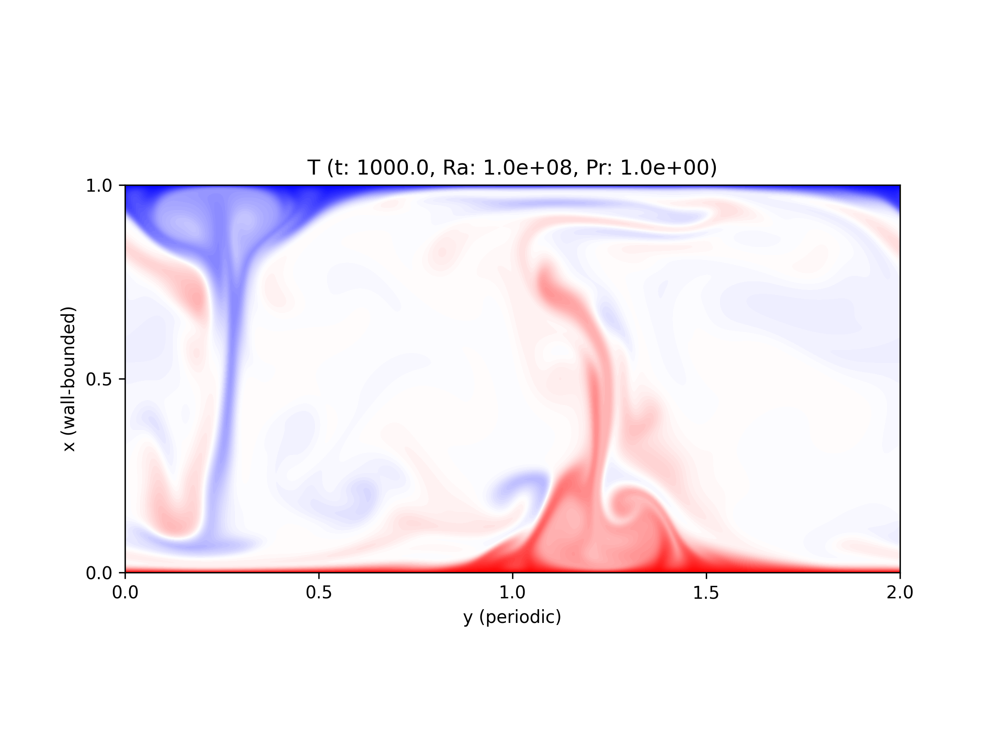
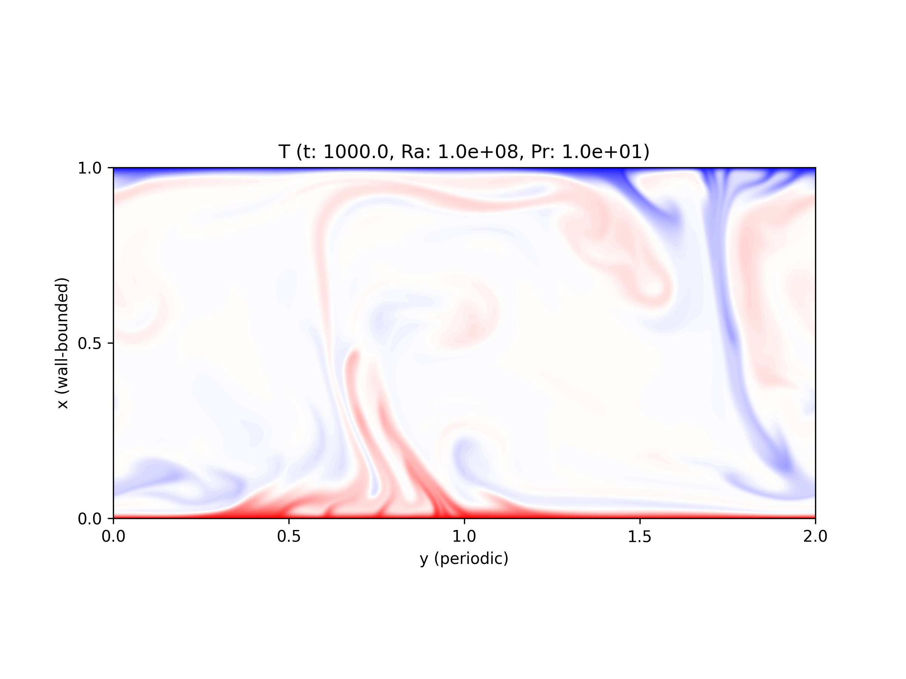

.. _example_case4:

.. include:: /references.txt

#############################
Case 4 - Turbulent statistics
#############################

*************
Configuration
*************

* :math:`500` time units to get rid of the initial condition effects

* :math:`500` time units (:math:`t = 500` to :math:`1000`) to collect statistics

* Aspect ratio :math:`\Gamma \equiv l_y / l_x = 2`

* Rayleigh number :math:`Ra = 10^8`

* Three Prandtl numbers are considered, :math:`Pr = 10^{-1}, 10^0, 10^1`

The other conditions can be found here (:math:`Pr = 10^0`):

.. code-block:: sh

   with_temperature=true \
   with_thermal_forcing=true \
   timemax=1.0e+3 \
   wtimemax=7.1e+3 \
   log_rate=1.0e+0 \
   log_after=0.0e+0 \
   save_rate=1.0e+2 \
   save_after=5.0e+2 \
   stat_rate=1.0e+0 \
   stat_after=5.0e+2 \
   ly=2.0e+0 \
   itot=512 \
   jtot=1024 \
   stretch=3 \
   Ra=1.0e+8 \
   Pr=1.0e+0 \
   mpirun -n 4 ./a.out

.. note::

   Spatial resolution is fixed to the above values, which over-resolves high Prandtl cases.

**************
Visualisations
**************

Temperature fields at :math:`t = 1000` are visualised.

:math:`Pr = 10^{-1}`:

:math:`Pr = 10^{ 0}`:

:math:`Pr = 10^{ 1}`:

***************
Nusselt numbers
***************

.. image:: images/nusselt_mean.pdf
   :width: 800

.. note::

   #. Reference results (data in blue) come from |VANDERPOEL2013|, table 2.

   #. :math:`Nu` (data in red) is computed based on the heat flux on the walls.

**********
Statistics
**********

In the following figures, different colours are used to distinguish Prandtl numbers.

.. math::
   \begin{cases}
      \color{red  }{\text{red  }} & Pr = 10^{-1} \\
      \color{blue }{\text{blue }} & Pr = 10^{ 0} \\
      \color{green}{\text{green}} & Pr = 10^{ 1}
   \end{cases}

====
Mean
====

Mean temperature profile leads

.. image:: images/temp1.pdf
   :width: 800

Points denote 5 computational grids in the vicinity of the wall.

Note that the wall-normal coordinate is normalised by the thermal boundary layer thicknesses

.. math::

   \delta_{T} \equiv \frac{1}{2 Nu}.

========
Variance
========

Fluctuations are as follows.

Temperature :math:`T^{\prime}`:

.. image:: images/temp2.pdf
   :width: 800

Wall-normal velocity :math:`\ux^{\prime}`:

.. image:: images/ux2.pdf
   :width: 800

Stream-wise velocity :math:`\uy^{\prime}`:

.. image:: images/uy2.pdf
   :width: 800

